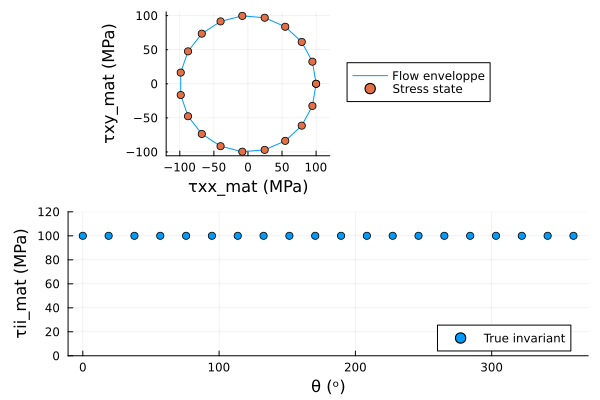
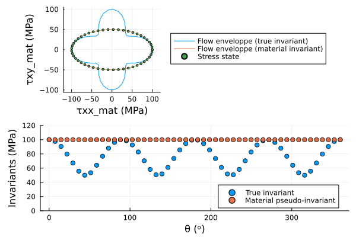
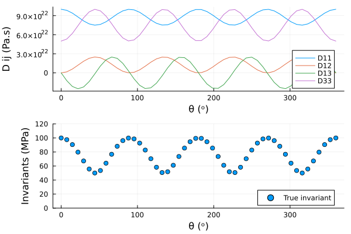
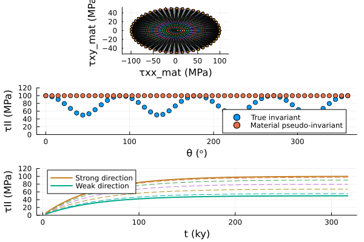
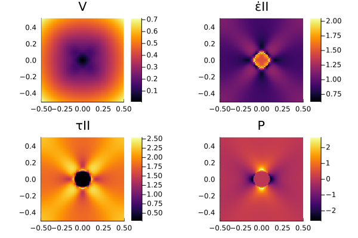
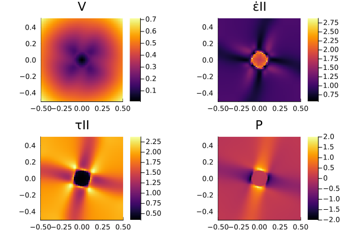

# Anisotropy Short Course 2026

The course takes place at the Goethe University of Frankfurt. It is supervised by Andrea Tommasi and Thibault Duretz, and with the support of Anna Bardroff, Filippo Zarabara and Lara Friedrichs.
This short course receives the support of the Heraeus foundation.

This web page only concerns the modelling part of the course.

|       |   |
| ----------- | ----------- |
|        |        |

## Before the lecture: Get ready!

Before the course, we kindly ask the participants to:

- install the [Julia](https://julialang.org) programming language together with the [VScodium code editor](https://vscodium.com)
- clone and launch the project
- do a basic exercise on array programming and data visualisation  

Dont worry if you don't get things to work on your own. We will take the time to get everything working in the first days of lecture (*after hours*).

### 1) Setting up Julia and VScodium

In this course we will use two softwares: the [Julia](https://julialang.org) programming language and the [VScodium code editor](https://vscodium.com).

### a) Install Julia

See the guide [here](https://apxml.com/courses/getting-started-julia-programming/chapter-1-introducing-julia-setup-first-steps/installing-julia-on-your-system).

Main steps:
- Get the program [juliaup](https://github.com/JuliaLang/juliaup), this tool allows to you to download and manage Julia versions. The tool `juliaup` is available for most platforms.
- Use juliaup to install a Julia version on your computer 

Some useful video resources about Julia installation and basic usage can be found in that [youtube channel](https://www.youtube.com/watch?v=N_CQQgKEbdc&list=PLHohvTggxulqYC3f1gq5x7UqKDteDhA4-).

### b) Install VScodium

Simply go to the [VScodium webpage](https://vscodium.com), download for your platform, and install.

### c) Install the Julia Language Support

Achtung: this step can only be done successfully if step a (and b) are completed.

- open VScodium
- click on the extensions tab to the left of the VScodium window   
- seach for Julia, you should find and install the Julia Language Support
 

Now you're ready for cloning the course and launching the project...

### 2) Cloning and launching the project

#### a) Cloning the repository using *git*

Once [Julia](https://julialang.org) and [VScodium code editor](https://vscodium.com) are installed, clone or download this repository from the GitHub web page.
We recommend that you **clone** the repository using *git* software (Windows users may have to install git, Linux/MacOS includes it already. You can test your installation by running `git -v` in the terminal. If git is installed properly, this should return its current version).
If you're not familiar with this workflow, you can read [this](https://www.datacamp.com/tutorial/git-clone-command) or ask help from your favourite AI.

The command line to clone the repository is:

`git clone https://github.com/tduretz/AnisotropyShortCourse2026.git`

This will create a new folder in the current directory. 

#### b) Launching into VScodium and testing

After successful cloning of the repository, you can open it locally on your computer:
- In VScodium: clik `File` > `New Window`.
- In VScodium: select the folder of the course `AnisotropyShortCourse2026` and open it.

Let's start the Julia REPL (terminal) from within VScodium.
Use the file explorer of VScodium, to left of the window, click on the tab:  
and open the file `start_julia.jl`.
Execute the file by pressing the play button located at the top-right of the file tab:

 

This will open the Julia REPL inside VScode. If successful, it will greet you with a warm welcome message.

 

Good! The now it's time to instantiate the Julia project. This step downloads and installs all the necessary Julia packages required for our work. In the Julia REPL, press `]`, this will lead you to the package mode

If successful, you should see this: 

 

Now, type the following command to finalise the procedure and press enter:

`instantiate`

... you probably have to wait a bit. If some packages fail to precompile, just restart Julia (press `Ctrl + D` in the REPL), restart it, and then it should work.

### 3) The preparatory exercise

Use the file explorer of VScodium, to left of the window, click on the tab:  

Open the [preparatory exercise](./scripts/part0/) located in `./scripts/part0/`, the file is called `ArrayProgramming_stud.ipynb`. This is a notebook file than can be edited inside VScodium, using the Julia kernel that was installed in the previous steps. 

Follow the steps and complete the exercise. The aim of the tutorial is to introduce you to working with arrays and visualising data in one and two dimensions.

There is also a very succint introduction to the use of automa tic differentiation ([`ForwardDiff.jl`](https://github.com/JuliaDiff/ForwardDiff.jl)), see the notebook [`AD_Basics.ipynb`](./scripts/part0/).

## [Part 1: Anisotropic rheology in 2D](./scripts/part1)

The lecture notes are available [here](https://next.hessenbox.de/index.php/s/S9JJ6BRqn6TRrqy).

The exercises scripts are available [there](./scripts/part1). 

*Exercise 1*: Program a basic viscous isotropic constitutive law.

*Exercise 2*: Rotate an isotropic material in a pure shear deformation field, check that the response **does not** depend on the orientation :D (0D) 

  

*Exercise 3*: Rotate an *ani*sotropic material in a pure shear deformation field, check that the response **does** depend on the orientation! 

  

*Exercise 4*: Use automatic differentiation to determine the constitutive operator in Cartesian coordinates.

  

 *Exercise 5*: Make it viscoelastic! 

  

## [Part 2: Anisotropic mechanics in 2D](./scripts/part2)

The lecture notes are available [here](https://next.hessenbox.de/index.php/s/S9JJ6BRqn6TRrqy).

The exercises scripts are available [there](./scripts/part2). 

*Exercise 1*: Program a visous **isotropic** constitutive law into a 2D mechanical code:

  

*Exercise 2*: Program a viscous **anisotropic** constitutive law into a 2D mechanical code:

  